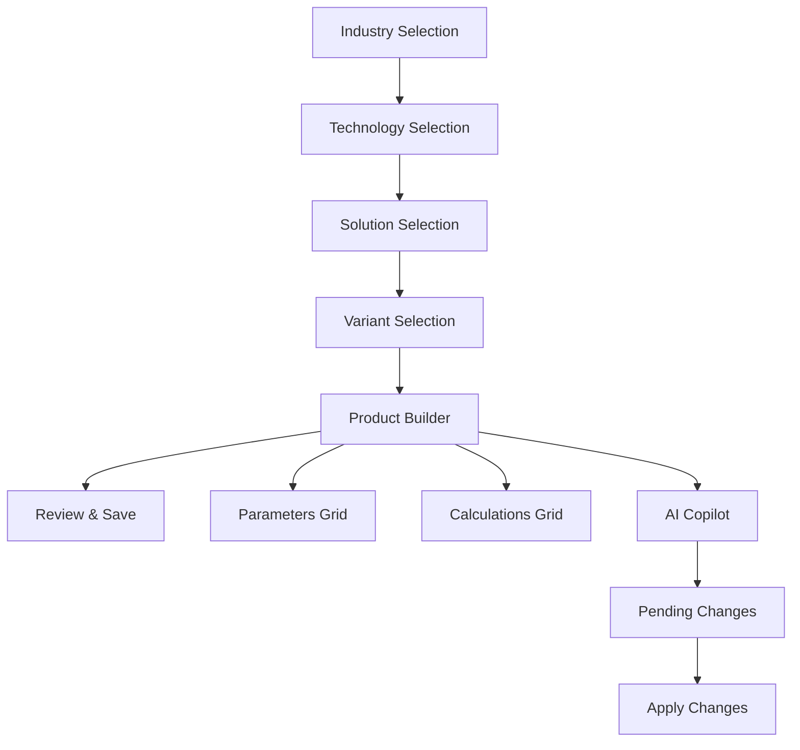

# Industrial Configuration Wizard

A sophisticated React + TypeScript application for configuring industrial systems through a wizard-driven interface with AI-powered assistance.

## 🚀 Quick Start

```bash
# Install dependencies
npm install

# Start development server
npm run dev

# Build for production
npm run build

# Run tests
npm test
```

## 🏗️ Architecture

### Tech Stack
- **Framework**: React 18 with TypeScript
- **Build Tool**: Vite
- **Styling**: Tailwind CSS v3 with JIT mode
- **UI Components**: shadcn/ui
- **State Management**: Zustand with persistence
- **Animations**: Framer Motion
- **Formulas**: mathjs for safe evaluation
- **AI Integration**: DeepSeek API (mocked)

### Application Flow



### Key Features

1. **5-Step Wizard Navigation**
   - Industry → Technology → Solution → Variant → Product
   - Route-based with persistent state
   - Progress tracking and validation

2. **Product Builder (Step 5)**
   - **Parameters Tab**: Editable grid with 4-level hierarchy
   - **Calculations Tab**: Formula builder with mathjs evaluation
   - Live parameter overrides with visual feedback

3. **AI Copilot Sidebar**
   - Toggle with Ctrl+/
   - Context-aware suggestions
   - Patch-based change management
   - Mock DeepSeek integration

4. **Advanced State Management**
   - Zustand store with localStorage persistence
   - Patch-based updates for undo/redo
   - Real-time calculation engine

## 📁 Project Structure

```
src/
├── components/           # Reusable UI components
│   ├── WizardLayout.tsx     # Main wizard container
│   ├── HierarchySelector.tsx # Dropdown selectors
│   ├── ParamGrid.tsx        # Parameters table
│   ├── CalcGrid.tsx         # Calculations table
│   ├── CalcBuilderModal.tsx # Formula editor
│   ├── CopilotSidebar.tsx   # AI assistant
│   ├── PendingChanges.tsx   # Change management
│   ├── VisualSummary.tsx    # Configuration overview
│   └── StepFooter.tsx       # Navigation controls
├── pages/wizard/         # Wizard step pages
│   ├── Step1.tsx            # Industry selection
│   ├── Step2.tsx            # Technology selection
│   ├── Step3.tsx            # Solution selection
│   ├── Step4.tsx            # Variant selection
│   └── Step5.tsx            # Product builder
├── store/                # State management
│   └── useParameterStore.ts # Zustand store
├── lib/                  # Utilities
│   └── deepseek.ts          # AI API adapter
├── data/                 # Static data
│   └── fixtures.ts          # Sample configurations
└── types/                # TypeScript definitions
    └── index.ts             # Core interfaces
```

## 🎨 Design System

### Color Palette
- **Glass Effect**: `backdrop-blur-md bg-white/30 dark:bg-slate-800/30`
- **Primary**: HSL-based color system with dark mode support
- **Animations**: Lime flash for parameter overrides

### Animation Patterns
- **Page Transitions**: Fade in with slide up
- **Sidebar**: Slide from right with spring animation
- **Parameter Changes**: Lime flash for 600ms
- **Loading States**: Spin animation

## 🧪 Testing

```bash
# Run test suite
npm test

# Run with coverage
npm run test:coverage

# Watch mode
npm run test:watch
```

### Sample Tests
- Wizard navigation flow
- Parameter override functionality
- AI patch application
- Formula validation

## 🔧 Configuration

### Environment Variables
Copy `.env.example` to `.env` and configure:

```env
VITE_DEEPSEEK_API_KEY=your_api_key_here
VITE_APP_NAME=Industrial Configuration Wizard
```

### Tailwind Extensions
- Custom glass effect utilities
- Animation keyframes for lime flash
- Backdrop blur variants

## 🤖 AI Integration

The application includes a mock DeepSeek adapter in `src/lib/deepseek.ts`. To integrate with the real API:

1. Add your API key to `.env`
2. Replace the mock implementation with actual HTTP calls
3. Configure proper error handling and rate limiting

### AI Capabilities
- Context-aware parameter suggestions
- Automatic calculation generation
- Formula optimization recommendations
- Validation and error detection

## 📊 Data Models

### Core Types
```typescript
interface Parameter {
  id: string;
  name: string;
  level: 1 | 2 | 3 | 4 | 5;
  units: string;
  defaultValue: number | null;
  value: number | null;
  description: string;
}

interface Calculation {
  id: string;
  name: string;
  formula: string; // mathjs expression
  units: string;
  description: string;
  value?: number;
}
```

### Sample Data
The app includes comprehensive fixture data for Data Centre Cooling systems with realistic parameters across all 4 hierarchy levels.

## 🚀 Deployment

```bash
# Build for production
npm run build

# Preview production build
npm run preview
```

The application is optimized for:
- Code splitting by route
- Tree shaking for minimal bundle size
- Progressive enhancement
- Accessibility compliance

## 🔍 Development

### Key Commands
- `Ctrl + /`: Toggle AI Copilot
- Hot reload enabled for all components
- TypeScript strict mode for type safety

### Performance Features
- Route-based code splitting
- Lazy loading for heavy components
- Optimized re-renders with Zustand
- Memoized calculations

---

Built with ❤️ using modern React patterns and best practices.
