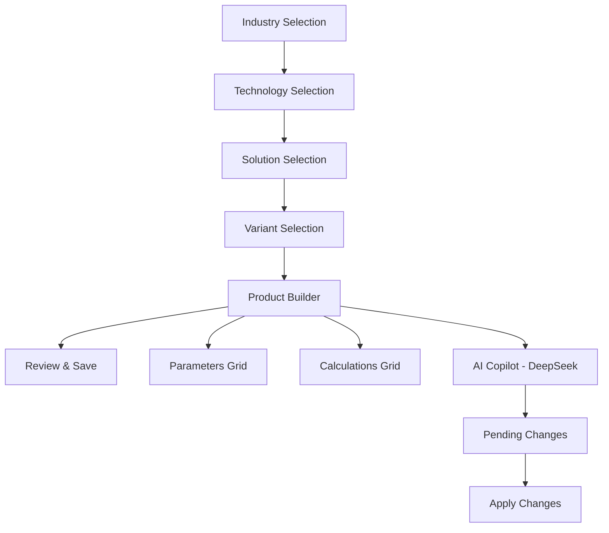

# Industrial Configuration Wizard

A sophisticated React + TypeScript application for configuring industrial systems through a wizard-driven interface with AI-powered assistance using DeepSeek API.

## 🚀 Quick Start

```bash
# Clone the repository
git clone https://github.com/AlexKapadia/config-wizard-forge.git
cd config-wizard-forge

# Install dependencies
npm install

# Set up environment variables
cp env.example .env
# Edit .env and add your DeepSeek API key

# Start development server
npm run dev

# Build for production
npm run build
```

## 🔧 Environment Setup

Create a `.env` file in the root directory with your DeepSeek API configuration:

```env
# DeepSeek API Configuration
VITE_DEEPSEEK_API_KEY=your_deepseek_api_key_here
VITE_DEEPSEEK_BASE_URL=https://api.deepseek.com
VITE_DEEPSEEK_MODEL=deepseek-chat

# Application Configuration
VITE_APP_NAME=Industrial Configuration Wizard
VITE_APP_VERSION=1.0.0
```

### Getting Your DeepSeek API Key

1. Visit [DeepSeek Console](https://platform.deepseek.com/)
2. Sign up or log in to your account
3. Navigate to API Keys section
4. Create a new API key
5. Copy the key and paste it in your `.env` file

## 🏗️ Architecture

### Tech Stack
- **Framework**: React 18 with TypeScript
- **Build Tool**: Vite
- **Styling**: Tailwind CSS v3 with JIT mode
- **UI Components**: shadcn/ui
- **State Management**: Zustand with persistence
- **Animations**: Framer Motion
- **Formulas**: mathjs for safe evaluation
- **AI Integration**: DeepSeek API with real-time chat

### Application Flow



### Key Features ✅

1. **5-Step Wizard Navigation**
   - Industry → Technology → Solution → Variant → Product
   - Route-based with persistent state
   - Progress tracking and validation

2. **Product Builder (Step 5)**
   - **Parameters Tab**: Editable grid with 4-level hierarchy
   - **Calculations Tab**: Formula builder with mathjs evaluation
   - Live parameter overrides with visual feedback

3. **AI Copilot Integration**
   - **DeepSeek API**: Real-time AI assistance
   - **Context-Aware**: Analyzes current configuration
   - **Smart Suggestions**: Parameter optimizations and calculations
   - **Patch System**: Apply AI suggestions with validation

4. **Advanced State Management**
   - Zustand store with localStorage persistence
   - Patch-based updates for undo/redo
   - Real-time calculation engine

5. **Modern UI/UX**
   - Glass morphism design
   - Dark mode support
   - Smooth animations with Framer Motion
   - Responsive design

## 📁 Project Structure

```
src/
├── components/           # Reusable UI components
│   ├── WizardLayout.tsx     # Main wizard container
│   ├── HierarchySelector.tsx # Dropdown selectors
│   ├── ParamGrid.tsx        # Parameters table
│   ├── CalcGrid.tsx         # Calculations table
│   ├── CalcBuilderModal.tsx # Formula editor
│   ├── CopilotSidebar.tsx   # AI assistant (DeepSeek)
│   ├── PendingChanges.tsx   # Change management
│   ├── VisualSummary.tsx    # Configuration overview
│   └── StepFooter.tsx       # Navigation controls
├── pages/wizard/         # Wizard step pages
│   ├── Step1.tsx            # Industry selection
│   ├── Step2.tsx            # Technology selection
│   ├── Step3.tsx            # Solution selection
│   ├── Step4.tsx            # Variant selection
│   └── Step5.tsx            # Product builder
├── store/                # State management
│   └── useParameterStore.ts # Zustand store
├── lib/                  # Utilities
│   └── deepseek.ts          # DeepSeek API adapter
├── data/                 # Static data
│   └── fixtures.ts          # Sample configurations
└── types/                # TypeScript definitions
    └── index.ts             # Core interfaces
```

## 🤖 AI Copilot Features

### DeepSeek Integration
The AI Copilot uses DeepSeek's advanced language model to provide intelligent assistance:

- **Context Analysis**: Understands your current configuration
- **Parameter Optimization**: Suggests improvements based on industry best practices
- **Calculation Generation**: Creates relevant formulas automatically
- **Technical Guidance**: Provides expert advice for industrial systems

### Usage Examples
```
User: "Optimize the cooling efficiency"
AI: Analyzes current parameters and suggests:
- Adjust air flow rate for better heat transfer
- Optimize temperature setpoints
- Create efficiency calculation

User: "Create a TCO calculation"
AI: Generates comprehensive TCO formula:
- Total CAPEX + (Annual OPEX × 5 years)
- Includes equipment, installation, energy costs
- Calculates payback period

User: "Suggest parameter improvements"
AI: Reviews current values and suggests:
- Industry-standard ranges
- Energy efficiency optimizations
- Cost-saving recommendations
```

### Keyboard Shortcuts
- `Ctrl + /`: Toggle AI Copilot sidebar
- `Enter`: Send message
- `Shift + Enter`: New line in chat

## 🛠️ Development

### Key Commands
```bash
npm run dev          # Start development server
npm run build        # Build for production
npm run preview      # Preview production build
npm run lint         # Run ESLint
```

### Performance Features
- Route-based code splitting
- Lazy loading for heavy components
- Optimized re-renders with Zustand
- Memoized calculations

## 📊 Data Models

### Core Types
```typescript
interface Parameter {
  id: string;
  name: string;
  level: 1 | 2 | 3 | 4 | 5;
  units: string;
  defaultValue: number | null;
  value: number | null;
  description: string;
}

interface Calculation {
  id: string;
  name: string;
  formula: string; // mathjs expression
  units: string;
  description: string;
  value?: number;
}
```

### Sample Data
The app includes comprehensive fixture data for Data Centre Cooling systems with realistic parameters across all 4 hierarchy levels.

## 🚀 Deployment

```bash
# Build for production
npm run build

# Preview production build
npm run preview
```

The application is optimized for:
- Code splitting by route
- Tree shaking for minimal bundle size
- Progressive enhancement
- Accessibility compliance

## 🔍 Troubleshooting

### Common Issues

1. **DeepSeek API Errors**
   - Verify your API key is correct
   - Check API key permissions
   - Ensure you have sufficient credits

2. **Formula Validation Errors**
   - Check parameter references exist
   - Verify mathematical syntax
   - Ensure no circular dependencies

3. **State Persistence Issues**
   - Clear localStorage if needed
   - Check browser storage limits
   - Verify Zustand configuration

## 📋 Implementation Status

### Frontend Complete ✅
- [x] 5-step wizard navigation
- [x] Parameter grid with overrides
- [x] Calculation builder and grid
- [x] Glass morphism UI design
- [x] Dark mode support
- [x] Responsive design
- [x] State management with Zustand
- [x] Route-based navigation
- [x] Animation system
- [x] DeepSeek AI integration
- [x] Real-time chat functionality
- [x] Patch validation system

### Ready for Production 🚀
- [x] Environment configuration
- [x] Error handling
- [x] API integration
- [x] User experience optimization

---

Built with ❤️ using modern React patterns and DeepSeek AI. Ready for production deployment!
