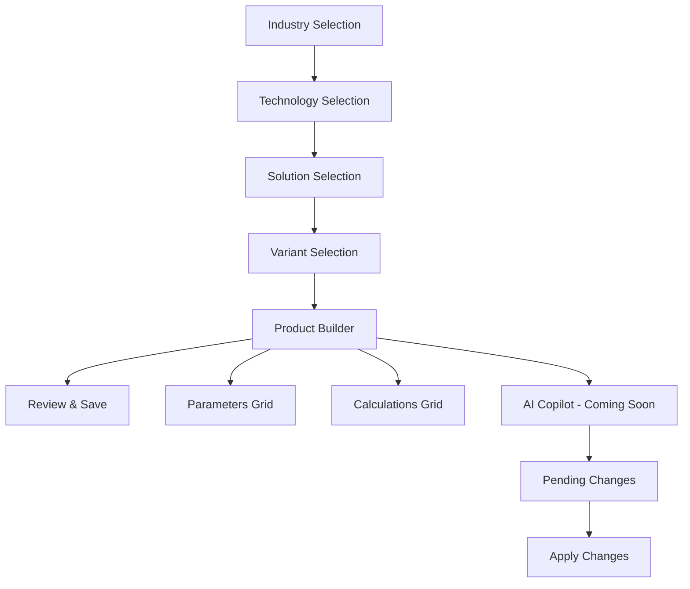

# Industrial Configuration Wizard

A sophisticated React + TypeScript application for configuring industrial systems through a wizard-driven interface with AI-powered assistance.

## 🚀 Quick Start

```bash
# Install dependencies
npm install

# Start development server
npm run dev

# Build for production
npm run build
```

## 🏗️ Architecture

### Tech Stack
- **Framework**: React 18 with TypeScript
- **Build Tool**: Vite
- **Styling**: Tailwind CSS v3 with JIT mode
- **UI Components**: shadcn/ui
- **State Management**: Zustand with persistence
- **Animations**: Framer Motion
- **Formulas**: mathjs for safe evaluation
- **AI Integration**: Ready for DeepSeek API integration

### Application Flow



### Key Features ✅

1. **5-Step Wizard Navigation**
   - Industry → Technology → Solution → Variant → Product
   - Route-based with persistent state
   - Progress tracking and validation

2. **Product Builder (Step 5)**
   - **Parameters Tab**: Editable grid with 4-level hierarchy
   - **Calculations Tab**: Formula builder with mathjs evaluation
   - Live parameter overrides with visual feedback

3. **Advanced State Management**
   - Zustand store with localStorage persistence
   - Patch-based updates for undo/redo
   - Real-time calculation engine

4. **Modern UI/UX**
   - Glass morphism design
   - Dark mode support
   - Smooth animations with Framer Motion
   - Responsive design

## 📁 Project Structure

```
src/
├── components/           # Reusable UI components
│   ├── WizardLayout.tsx     # Main wizard container
│   ├── HierarchySelector.tsx # Dropdown selectors
│   ├── ParamGrid.tsx        # Parameters table
│   ├── CalcGrid.tsx         # Calculations table
│   ├── CalcBuilderModal.tsx # Formula editor
│   ├── CopilotSidebar.tsx   # AI assistant (UI ready)
│   ├── PendingChanges.tsx   # Change management
│   ├── VisualSummary.tsx    # Configuration overview
│   └── StepFooter.tsx       # Navigation controls
├── pages/wizard/         # Wizard step pages
│   ├── Step1.tsx            # Industry selection
│   ├── Step2.tsx            # Technology selection
│   ├── Step3.tsx            # Solution selection
│   ├── Step4.tsx            # Variant selection
│   └── Step5.tsx            # Product builder
├── store/                # State management
│   └── useParameterStore.ts # Zustand store
├── lib/                  # Utilities
│   └── deepseek.ts          # AI API adapter (placeholder)
├── data/                 # Static data
│   └── fixtures.ts          # Sample configurations
└── types/                # TypeScript definitions
    └── index.ts             # Core interfaces
```

## 🛠️ What's Missing - Implementation Needed

### 1. AI Integration (Priority: High)
- **DeepSeek API Integration**: Replace mock implementation in `src/lib/deepseek.ts`
- **API Key Configuration**: Set up environment variables
- **Context-Aware Suggestions**: Implement parameter and calculation recommendations
- **Formula Optimization**: AI-powered formula improvements

### 2. Backend Integration (Priority: Medium)
- **Data Persistence**: Save configurations to database
- **User Management**: Authentication and user sessions
- **Configuration Sharing**: Export/import functionality
- **Audit Trail**: Track changes and versions

### 3. Testing Suite (Priority: Medium)
- **Unit Tests**: Component testing with Jest/React Testing Library
- **Integration Tests**: Wizard flow and state management
- **E2E Tests**: Complete user journey testing

### 4. Advanced Features (Priority: Low)
- **Real-time Collaboration**: Multiple users editing same config
- **Advanced Validations**: Cross-parameter validation rules
- **Calculation Dependencies**: Complex formula relationships
- **Export Formats**: PDF, Excel, CSV export options

## 🤖 AI Integration Setup

The application includes a placeholder DeepSeek adapter in `src/lib/deepseek.ts`. To integrate:

### Required Environment Variables
```env
VITE_DEEPSEEK_API_KEY=your_api_key_here
VITE_DEEPSEEK_BASE_URL=https://api.deepseek.com
```

### Implementation Steps
1. **Replace Mock Function**: Update `deepSeekChat` function with actual API calls
2. **Error Handling**: Add proper error handling and rate limiting
3. **System Prompts**: Configure AI prompts for industrial context
4. **Patch Generation**: Implement proper patch creation from AI responses

### Expected AI Capabilities
- Context-aware parameter suggestions
- Automatic calculation generation
- Formula optimization recommendations
- Validation and error detection

## 🎨 Design System

### Color Palette
- **Glass Effect**: `backdrop-blur-md bg-white/30 dark:bg-slate-800/30`
- **Primary**: HSL-based color system with dark mode support
- **Animations**: Pulse effect for parameter overrides

### Animation Patterns
- **Page Transitions**: Fade in with slide up
- **Sidebar**: Slide from right with spring animation
- **Parameter Changes**: Pulse animation for overrides
- **Loading States**: Spin animation

## 📊 Data Models

### Core Types
```typescript
interface Parameter {
  id: string;
  name: string;
  level: 1 | 2 | 3 | 4 | 5;
  units: string;
  defaultValue: number | null;
  value: number | null;
  description: string;
}

interface Calculation {
  id: string;
  name: string;
  formula: string; // mathjs expression
  units: string;
  description: string;
  value?: number;
}
```

### Sample Data
The app includes comprehensive fixture data for Data Centre Cooling systems with realistic parameters across all 4 hierarchy levels.

## 🚀 Deployment

```bash
# Build for production
npm run build

# Preview production build
npm run preview
```

The application is optimized for:
- Code splitting by route
- Tree shaking for minimal bundle size
- Progressive enhancement
- Accessibility compliance

## 🔍 Development

### Key Commands
- `Ctrl + /`: Toggle AI Copilot
- Hot reload enabled for all components
- TypeScript strict mode for type safety

### Performance Features
- Route-based code splitting
- Lazy loading for heavy components
- Optimized re-renders with Zustand
- Memoized calculations

## 📋 Implementation Checklist

### Frontend Complete ✅
- [x] 5-step wizard navigation
- [x] Parameter grid with overrides
- [x] Calculation builder and grid
- [x] Glass morphism UI design
- [x] Dark mode support
- [x] Responsive design
- [x] State management with Zustand
- [x] Route-based navigation
- [x] Animation system

### Ready for Integration 🔄
- [ ] DeepSeek AI API integration
- [ ] Backend data persistence
- [ ] User authentication
- [ ] Test suite implementation
- [ ] Production deployment setup

---

Built with ❤️ using modern React patterns and best practices. Ready for AI and backend integration!
